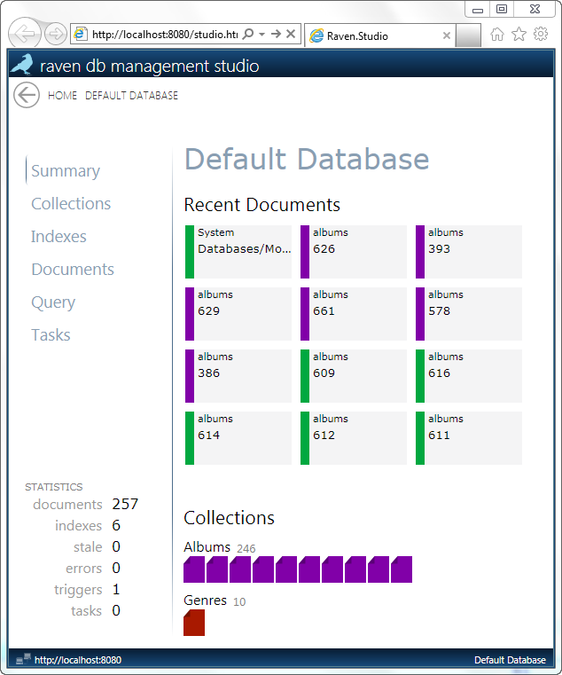
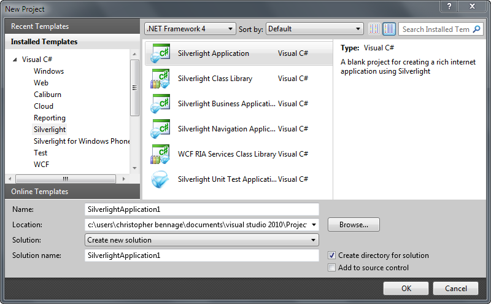
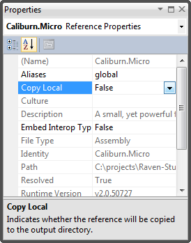

Extending RavenDB Management Studio
*********************************************

.. contents:: In this chapter...
  :depth: 3

RavenDB Management Studio (or more simply, Studio) has a number of extension points where developers can augment its functionailty.

What do you need to know?
============================

Developing plugins for Studio is easy to do. However, there are a set of technologies that you need to be familiar with.

* `Silverlight <http://www.silverlight.net/getstarted/>`_
* `Managed Extensibility Framework (or MEF) <http://mef.codeplex.com/wikipage?title=Overview&referringTitle=Home>`_
* `Caliburn Micro <http://caliburnmicro.codeplex.com>`_
* `RavenDB's Silverlight API <https://github.com/ravendb/ravendb/tree/master/Raven.Client.Silverlight>`_
* `Task Parallel Library for Silverlight <http://msdn.microsoft.com/en-us/vstudio/gg316360.aspx>`_

Don't let this list discourage you. As long as you know the basics of C# and Silverlight, 
we'll cover everything else you'll need to know to build plugins.

Silverlight
^^^^^^^^^^^^

Studio is developed using Silverlight 4. Silverlight is Microsoft's platform for building *Rich Internet Applications*. 
Resources for learning Silverlight are plentiful. If you are completely new to Silverlight, then we recommend:

* `Getting Started with Silverlight <http://tekpub.com/productions/ag>`_
* `Tekpub's Mastering Silverlight 4 <http://www.silverlight.net/getstarted/>`_

This guide assumes basic Silverlight and C# skills.

Managed Extensibility Framework
^^^^^^^^^^^^^^^^^^^^^^^^^^^^^^^

MEF is a library for composing applications at runtime. It was developed by Microsoft primarily supporting
extensions for Visual Studio 2010. In addition, MEF is built into Silverlight. These characteristics make it an ideal 
choice for developing plugins for Studio.

We'll cover the basics of MEF that are required to build plugins for Studio.

Caliburn Micro
^^^^^^^^^^^^^^

Caliburn Micro is an open source framework that facilitates building applications in Silverlight. It is particularly
useful when using architectural patterns such as `Model-View-ViewModel (or MVVM) <http://en.wikipedia.org/wiki/Model_View_ViewModel>`_.
Studio itself is built using Caliburn Micro.

There is very little about Caliburn Micro that you *need* to know in order to develop plugins. We'll cover those basics for you.

If you are interested in learning more about Caliburn Micro and how it can reduce your development time, vist the 
`project site <http://caliburnmicro.codeplex.com>`_.

RavenDB's Silverlight API
^^^^^^^^^^^^^^^^^^^^^^^^^
RavenDB ships with an API Silverlight. This API is found in the Silverlight assembly **Raven.Client.Silverlight.dll** and it is independent
from Studio. The API itself is documented elsewhere and is designed to be easily discoverable. We'll refer to this as the *client* API.

In addition, Studio has an API for plugin development built on top of the client API. The *plugin* API is found in the Silverlight
assembly **Raven.Studio.dll** and most of the classes we'll use will be in the ``Raven.Studio.Plugins`` namespace.

Task Parallel Library
^^^^^^^^^^^^^^^^^^^^^
Both the client API and Studio make heavy use of Microsoft's Task Parallel Library. This library is built into .NET 4, but it is not
a native part of Silverlight 4. However, Microsoft has provided this library for Silverlight developers as part of the `Visual Studio Async CTP <http://msdn.microsoft.com/en-us/vstudio/async.aspx>`_.
The library is designed to simplify asynchronous programming. The CTP contains the Silverlight assembly **AsyncCtpLibrary_Silverlight.dll**.

Its usage with respect to RavendB can be identified by the class **System.Threading.Tasks.Task** and by the extension method **ContinueWith**.

Types of Plugins
============================

At the time of this writing, there are two places to extend Studio. More extension points are planned for the future.

* Explorer Items
* Tasks

Explorer Items
^^^^^^^^^^^^^^

When a database is selected in Studio, you are presented with the *Database Explorer* screen as shown in figure 1.1.

  Figure 1.1 - The Database Explorer

The Database Explorer is a collection of high level features. The features are exposed as a menu of options on the left-hand side.
The menu options are referred to as *Explorer Items*. When you click on an Explorer Item in the menu, the corresponding screen is
opened in the right-hand pane. New Explorer Items can be added to the menu using plugins.

There is no limitation on the sort of functionality that can be implemented inside an Explorer Item.

The intention of the Database Explorer is to allow a user to quickly access frequently used functionality. Extending the Database 
Explorer should be done sparingly.

Tasks
^^^^^^^^^^^^^^

One of the default Explorer Items is *Tasks*. As its name implies, the Tasks item is intended to be a collection of utilities for 
managing a database. An individual utility on the screen is referred to as a *Task*. For example, Studio ships with an Export Task
and an Import Task.

There is no limitation on the sort of functionality that can be implemented inside a Task.

Extending Studio with a Task is preferred over using an Explorer Item.

Building a Plugin
============================

The process of building Tasks and Explorer Items is nearly identical. We'll walk through the steps for constructing a new task,
but we'll also point out the differences that you would want to address when developing an Explorer Item.

For this tutorial, we will assume that our plugin is meant to work with the sample data that can be generated in an empty 
database by Studio. Let's go ahead and generate a sample database now.

* Launch RavenDB Managmenet Studio
* Click the *HOME* link in the upper left corner
* Click *Create New Database* on the bottom of the right-hand pane.
* Give the new database a name and click *Create*.
* With the new database selected, click *Use this database*
* Navigate to the Summary screen
* Click *Create sample data*

Creating a Plugin Project
^^^^^^^^^^^^^^^^^^^^^^^^^

Open Visual Studio 2010, a create a new Silverlight Application.

* File | New | Project
* In the New Project dialog, select Silverlight Application and click Ok. You can locate the project template using the search bar in the upper right corner of the dialog.
* In the New Silverlight Application Dialog, uncheck *Host the Silverlight application in a Web site* and make sure that Silverlight 4 is selected under Options then click Ok.
* Delete MainPage.xaml. 
* Delete App.xaml.

Be sure to select a Silverlight Application and not a Silverlight Class Library. The Silverlight Appliccation will produce a *xap* file 
when compiled. Xap files are the unit of deployment for Silverlight application and for Studio plugins as well.

  Figure 1.2 - New Silverlight Project

Referencing Assemblies
^^^^^^^^^^^^^^^^^^^^^^

There is a minimum set of assemblies that you will need to reference in order to build a plugin for Studio. It is important that these
assemblies match the versions that are included with Studio. The assemblies are:

* AsyncCtpLibrary_Silverlight.dll
* Caliburn.Micro.dll
* Newtonsoft.Json.Silverlight.dll
* Raven.Client.Silverlight.dll
* Raven.Studio.dll
* System.Windows.Controls.Toolkit.dll
* System.ComponentModel.Composition.dll

You can acquire the set of assemblies (with the exception of System.ComponentModel.Composition.dll) by locating the file 
**Raven.Studio.xap**. This file is the result of compiling the Raven.Studio project in the RavenDB source. Rename the file 
to Raven.Studio.zip. You can then unzip the file and copy all the required assemblies.

Let's return to our sample plugin.

* Right-click on the project in the Solution Explorer and select Add Reference.
* Go to the Browse tab, then locate and select the assemblies we extracted from Raven.Studio.xap. 
* Click Ok
* Select Add Reference again, but this time the .NET tab.
* Locate and select System.ComponentModel.Composition. Click Add.
* After all of the assemblies have been added, expand the References node in Solution Explorer
* Right-click on one of the assemblies we just added and select Properties.
* In the Properties panel for the assembly, set Copy Local to False
* Repeat setting Copy Local to False for each of the assemblies we just added.

.. figure::  _static/1.3-AddReference.png

  Figure 1.3 - Adding References

We've already mentioned that the unit of deployment for Raven plugins is a xap file. Any assembly that we reference in our Silverlight 
Application will be included in the xap file when we compile. This can significantly (and unnecessarily) increase the size of our plugin. 
In fact, the combined size of these assemblies is about 1.75MB. Including these assemblies is unnessary because they will already be 
loaded by Studio itself before the plugin loads. By setting the property Copy Local to False for each of the referenced 
assemblies, we are telling the build process not to include the referenced assembly in the resulting xap.

  Figure 1.4 - Set Copy Local to False for each assembly

Adding the Plugin Interface
^^^^^^^^^^^^^^^^^^^^^^^^^^^

You have a great deal of liberty in deciding how to implement your plugin for Studio. However, Studio does make a couple of assumptions
about the structure of your plugin and we need to obey a few rules.

These rules can be summarized:

* Identify plugins using export attributes.
* Start with *view model* classes that represent the behavior of the plugin.
* Fllow naming conventions to associate the xaml *view* with the *view model* class.

Both Tasks and Explorer Items are classes that have been decorated with attributes that identify them as one of the extensions.

* Right-click on the project in the Solution Explorer and select Add | Class
* In the New Item dialog, name the class MyFirstTask and click Add.
* Add the using statement to our new class: ``using Raven.Studio.Plugins.Tasks;``
* Decorate the class with the attribute: ``[ExportTask("My First Task", Index = 100)]``
* Make the class inherit from ``Caliburn.Micro.Screen``.

The resulting class now looks like this::

	using Raven.Studio.Plugins.Tasks;
	using Caliburn.Micro;

	namespace MyFirstStudioPlugin
	{
	    [ExportTask("My First Task", Index = 100)]
	    public class MyFirstTask : Screen
	    {

	    }
	}

The attribute ``Raven.Studio.Plugins.Task.ExportTask`` identifies this class as a new Task for Studio to load. The term "Export" in the 
attribute name is from MEF. "Exporting" a class is how we let MEF know that this is a class it will be interested in. ``ExportTask`` has
two parameters. The first is required and it is the string text to be displayed in the Tasks menu. ``Index`` is optional. It identifies 
the position of item on the menu. Menu items are sorted in ascending order.

We also inherit from Caliburn Micro's screen. This class provides two features we'll make use of. First, it has a convenient
implementation of ``INotifyPropertyChanged``. Secondly, it provides some basic life cycle hooks such as ``OnInitialize``, ``OnActivate``,
and ``OnDeactivate``.

.. note::

  If you want to create an Explorer Item, instead of a Task, use the attribute ``Raven.Studio.Plugins.Database.ExportDatabaseExplorerItem``
  instead of ``ExportTask``.

The class marked with the export attribute is the core of your plugin. It defines the behavior. Still, has does the user interact with 
this class. We need to have some XAML associated with it that defines the actual screen that the user sees and interacts with.
In this context, the exported class is a *view model* and the associated xaml that we have not yet created is the *view*.  

Studio follows the 'view model first' philosophy. This means that the plugin infrastructure begins by identifying the exported class
(that is, the view model) and then tries to find the associated view needed to render it. Caliburn Micro handles all the details of
wiring up the view and the view model for us. All you need to do is follow a naming convention.

By default, if your view model is name ``Something`` then Studio will look for a view called ``SomethingView``.

.. note::
  
    Alternatively, you can name all of your view models with the suffix "ViewModel" and all of your views with the suffix "View".
    Personally, I prefer the more succint approach of not having a suffix for my view models. You can learn more about the default
    naming conventions used by Caliburn Micro `here <http://caliburnmicro.codeplex.com/wikipage?title=All%20About%20Conventions&referringTitle=Documentation>`_.

* Right-click on the project in the Solution Explorer and select Add | New Item
* Locate and select Silverlight User Control
* Name the user control **MyFirstTaskView**
* Click Add

When we run our plugin, Caliburn Micro will use the user control ``MyFirstTaskView`` to render the exported class ``MyFirstTask``.

Accessing Studio Services
^^^^^^^^^^^^^^^^^^^^^^^^^

In order for our plugin to useful, we need to have access to the context and services provided by Studio.

This is primarily provided through the ``IServer`` interface.

* Open the class MyFirstTask
* Add using statements for ``Raven.Studio.Plugins`` and ``System.ComponentModel.Composition``.
* Add the following code to the class::

	readonly server;

	[ImportingConstructor]
	public MyFirstTask(IServer server)
	{
		this.server = server;
	}

The definition of ``IServer`` can be `viewed here <https://github.com/ayende/ravendb/blob/master/Raven.Studio/Plugins/IServer.cs>`_.

ImportingConstructor is another MEF attribute. This one tells MEF that we have a dependency on an instance of ``IServer``
and that we need MEF to 'import' this instance for us. In other words, MEF will automatically inject the instance provided
by Studio when our plugin is loaded at runtime. There are other services we can import as well.

Now, let's say the we want our plugin to display the documents returned when we query against the Artists index where Name starts with
'a'. In addition, we want to execute this query whenever the screen is viewed. Since our plugin inherits from ``Screen``, we can use 
Caliburn Micro's ``OnActivate`` to load the documents. ``OnActivate`` is called each time the screen is activated (that is, each time 
we request the screen to be viewed such as when we click on the menu item to display it).

* Add the using statement to *MyFirstTask*: ``using Database.Data;``
* Add the following code to *MyFirstTask*::

	protected override void OnActivate()
	{
		var query = new IndexQuery {Query = "Name:a*"};

		using (var session = server.OpenSession())
		{
			session.Advanced.AsyncDatabaseCommands
				.QueryAsync("Artists", query, new string[]{})
				.ContinueWith(x =>
				{
					var r = x.Result.Results;
				});
		}
	}

First, we define a query using the `Lucene syntax <http://lucene.apache.org/java/2_3_2/queryparsersyntax.html#Wildcard Searches>`_.
We want all the of the documents where the Name field starts with the character 'a'.

Next we create an instance of `IAsyncDocumentSession <https://github.com/ayende/ravendb/blob/master/Raven.Client.Lightweight/IAsyncDocumentSession.cs>`_
by calling ``OpenSession`` on the ``IServer`` instance that was injected into the constructor of ``MyFirstTask``.

Once we have a session, we can use it to execute our query against an index. ``QueryAsync`` takes the name of an index, the actual 
query, and a set of document ids to include. We will use *Artists* for the index. It was created for us when we generated the 
sample data. We don't need any includes, so we'll just provide an empty array.

``QueryAsync`` returns an instance of ``Task<QueryResult>``. The term 'Task' here is not to be confused with the category of plugins 
called Tasks. Instead, this Task comes from the asynchronous programming API called the Task Parallel Library (or TPL). It means that we have
some asynchronous operation and that operation is called a *task*. TPL provides a convenient extension method, ``ContinueWith``.

``ContinueWith`` allows us to provide a callback for what happens after the task completes. In our example, we are simply providing
an inline lambda that does nothing.  It is important to note though that the ``x`` in our lambda is the ``Task<QueryResult>`` that is
returned from ``QueryAsync``. We can examine it's properties to see what the result of our asychronous operation was. In the case of 
everything executing correctly, the ``Result`` property will contain an instance of ``QueryResult`` and from there we can get the 
actuall documents returned from the Raven server.

TODO: how deep should we go?

Installing a Plugin
============================

In order to make a Studio plugin available on a Raven server, simply drop the xap file into the plugins directory for the server.
By default, the directory is ``~\Plugins``. However, you can specify a different location be modifying the config file for the 
server. Simply add a new setting under ``<appSettings>``::

  <add key="Raven/PluginsDirectory" value="YourDirectory"/>

To load the plugin in Studio, just refresh the browser hosting Studio.

Debugging a Plugin
============================
TODO:

Class Reference
============================
TODO: